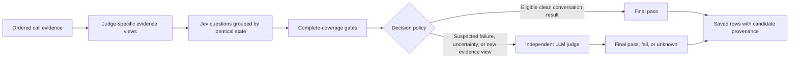

# Evidence-first evals: initial dev rollout

## Problem and decision

The original Jev path could turn a confident failure into a final failure before an LLM wrote its explanation. Node questions received full-call history without a separate target-node transcript. Variable exclusions applied after reduction could also turn an incomplete assessment into a pass.

This change separates evidence preparation, candidate classification, decision policy, independent review, and the final saved verdict. Existing judge rubrics and persisted verdict fields remain the public contract.

## Required behavior

- Preserve chronological ingest turns, including node ownership on revisits. Legacy/prebuilt inputs without an ordered timeline explicitly report that limitation; never invent inter-node order from grouped nodes.
- Prepare shared call views once. Node questions get explicit target-node identity and transcript; other nodes are context. Hallucination claim questions and agent speech belong only to the target node, while grounding can use call-wide context.
- Exclude structured platform idle turns from loop evidence. Preserve other judges' evidence.
- Combine questions only over identical states and only within both request budgets. Keep axis/question mapping and complete-coverage reduction across logical variable chunks. Oversized requests remain review candidates.
- Apply deterministic variable exclusions before reducing probabilities. Missing, uncertain, or capped required evidence cannot become a pass merely because a different defect was excluded.
- Uncertain custom applicability cannot establish a pass. Low applicability is an unknown candidate, requiring independent review.
- Every suspected failure goes to the full existing LLM judge, which may confirm or overturn it. Do not give the reviewer Jev's accusation or probability. Remove reason-only review from the active session flow.
- Retain candidate probabilities, question/ignored/missing keys, truncation, gates, model, evidence/question/policy versions, and review route alongside the final backend and verdict. Keep Jev probability separate from the LLM rubric score. Preserve per-node custom provenance through fan-out.
- Preserve channel gating, conversation priority rules, custom roll-up, unavailable handling, and `JEV_MODE=off` behavior.

## Conservative first phase

The policy is `verify-failures-v2`. Only clean, complete built-in conversation candidates over the unchanged `speech-v1` view may pass automatically. Changed node views (`node-evidence-v2`) and all custom metrics run through the LLM even when Jev is confident. Gate overrides cannot bypass this restriction. Node probabilities are collected for calibration, not used to publish new automatic decisions.

This phase can cost more and take longer than the previous Jev-first path because node judges now run independently. A representative clean single-node fixture makes three Jev requests (previously four) and seven LLM judge calls (previously three). These are fixture counts, not production cost or latency measurements. The intent is trustworthy decisions first, then measured automation.

No new deployment setting or database migration is required. `JEV_JUDGES` still selects candidate collection; `JEV_CUSTOM_METRICS` still selects custom candidate collection. `JEV_MODE=off` returns to the existing LLM-only path. Configuration changes require a process restart in the current deployment.

## Validation and promotion

Local tests prove control-flow and data-contract behavior: ownership, idle exclusion, grouping, missing answers, guarded variables, custom applicability, failure reversal/confirmation, provenance fan-out, provider errors, and rollback. Mocked probabilities do not measure model accuracy.

Before enabling node auto-pass, use fresh calls that were not used for tuning, with human-reviewed labels at judge plus node scope. Run the complete evaluator through final fan-out, retain suppressed/missing/unknown outcomes, and compare per-judge false negatives, false positives, auto-pass coverage/error, overrides, tokens, and latency. Freeze the call set and label revision; record code, model, evidence, question, gate, and policy versions. Correct disputed labels before computing accuracy. Do not count the reviewer model's own outputs as independent ground truth.

Promotion requires an explicit follow-up policy change backed by these results. This PR makes no new accuracy, cost-saving, or production-readiness claim. Compact hallucination retrieval can still omit relevant context, and existing LLM judging is not infallible; the initial review policy limits dependence on those uncalibrated candidates.

## Manager narration

“We already have a working evaluation pipeline in dev. We are strengthening how it reaches a decision. First, we will give each check the evidence for the exact part of the call it owns. Then we will group checks that use the same evidence to avoid sending duplicate context. The fast model will flag possible problems, and the detailed judge will verify them before we mark a call as failed. Missing information will go to review rather than silently becoming a pass.

“We will keep a record of both the initial signal and the final decision, so we can explain and audit the result. Initially, the new node checks will still receive detailed review. We will test their accuracy on fresh, independently reviewed calls before allowing them to pass automatically. This may cost more during validation; the goal is to earn the efficiency improvement with evidence.”
