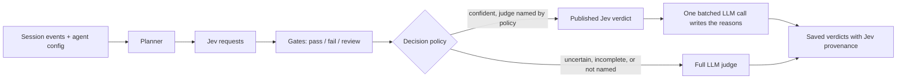

# Evidence-first evals with Jev

Jev (TypeSafe System One) is a fast yes/no classifier. With `JEV_MODE=primary`, every built-in binary judge is first put to Jev as one or more Noul questions, each answered with P(defect). A per-judge gate turns each probability into pass, fail or review. A decision policy then decides which confident outcomes stand. Everything else goes to the existing LLM judge, which runs exactly as it does with Jev off.

## Request layouts (`JEV_LAYOUT`)

**`shared`** (`shared-state-v1`, `src/evals-engine/jev/plan-shared.ts`) sends two requests per session:

| request | state | questions |
|---|---|---|
| `c` | the call's speech only | the six conversation detections (voicemail, bot, screening, low engagement, wrong number, do not disturb) |
| `s0` | `agent` (global prompt, global variables, instruction paragraphs shared by 2+ nodes) and `nodes.n<i>` (each node's instructions, variables, recorded values with their sources, exit, labelled events, and runtime excerpts) | every node judge: loop, adherence, intent, variable extraction, hallucination |

Data that only one question needs travels inside that question, not in the shared state:

- **Intent:** the intent catalog and the chosen intent are inside the intent questions. Each fired intent also gets its own condition question.
- **Hallucination:** besides the broad hallucination questions, there is one question for each agent line that gives a reason or requirement (at most 6). Unlike `views`, this layout asks no per-token claim questions; it was measured without them.

If a session is too large for one state, its nodes are split across `s0` and `s1`, and the conversation questions carry the speech inside the question. If the speech itself is too long for that, the session sends `c` plus an `s0` holding the nodes that fit; the remaining nodes go to the LLM. The layout never sends more than two requests.

**`views`** (`plan.ts`, the default) sends one request per evidence view: `c`, plus `a<i>`, `i<i>`, `n<i>`, `h<i>`, `v<i>.<chunk>` and `l<i>` for each node. Questions over an identical state share a request.

## Gates and policy

A pass needs an answer to every question on its axis. The axis goes to review instead when any of these happens:

- an answer is missing;
- the request is over budget, or Jev rejects it as overflowing;
- a question list was capped (variables, claims or reason lines beyond their caps).

Default gates (`src/jev/gates.ts`, overridable with `JEV_GATES`):

| judge | pass when P ≤ | fail when P ≥ |
|---|---|---|
| node_loop | 0.28 | 0.85 |
| intent_identification | 0.23 | never |
| instructions_adherence | 0.26 | never |
| variable_extraction | 0.19 | 0.90 |
| hallucination | 0.35 | never |
| conversation detections | 0.07–0.20 | 0.80–0.86 |
| custom metrics | 0.20 | 0.80 |

Policy `verify-failures-v3` (`src/evals-engine/jev/policy.ts`):

- A confident conversation pass stands.
- A confident node pass stands only for judges named in `JEV_NODE_AUTO_PASS`. If an intent fired, its pass stands only when every fired intent was asked against its own condition, which only the `shared` layout does; under `views` a fired intent always goes to the LLM.
- A confident fail stands only for judges named in `JEV_AUTO_FAIL`. Intent, adherence and hallucination ship with gates that never fail.
- Custom metrics are always decided by the LLM.
- One batched LLM call writes the reasons for published fails, and also for published passes when `JEV_DECISION_REASONS=all`.

With `primary`, every check Jev was asked records:

- its backend and the Jev probability;
- the gate and question keys used;
- the evidence, question and policy versions;
- the layout, under `shared`.

## Failure handling

- When a request fails, times out, overflows or is over budget, its axes go to the LLM. If planning or gating fails, the whole session goes to the LLM. A Jev problem never fails a session.
- After five consecutive service failures, Jev is skipped for 60 seconds, so an outage does not add a timeout to every session.
- `JEV_MODE=off` makes no Jev calls. It does **not** undo the node-judge changes that ship alongside Jev (`node-evidence-v3`), which apply in both modes:
  - node-scoped, event-labelled evidence;
  - variable values as of the node's exit;
  - `[tool failed]` markers on failed tool results;
  - the judge contracts in `judge-contracts.ts`.

## Validation

**Offline.** 920 labelled sessions were replayed through both layouts at the shipped gates. On the held-out set, `shared` decided 68% of node checks against 62% for `views`, with 2 unsafe passes against 3, and no false fails.

**Live.** 100 test calls ran with `JEV_LAYOUT=shared`, `JEV_NODE_AUTO_PASS=all` and `JEV_AUTO_FAIL=node_loop,variable_extraction`:

- Every session sent exactly two requests, with no fallbacks; one of the 100 used the packed layout.
- Reference labels came from blind model reviewers, and every disagreement was adjudicated by hand.
- All 1157 checks Jev decided were correct. Of the 380 checks the LLM decided, 346 (91%) were correct.
- 12 checks were excluded from scoring as open policy questions.
- Jev decided 1167 of all 1630 saved checks (72%); the scored subset above excludes checks the reviewers marked unclear, borderline or not applicable.

## Turning it on

1. Set `JEV_MODE=primary`, `JEV_API_KEY` and `JEV_LAYOUT=shared` (the layout the live numbers above were measured on). With the default switches, only conversation passes stand.
2. Once that is healthy, name node judges in `JEV_NODE_AUTO_PASS` and `JEV_AUTO_FAIL`.

With `primary`, each session's data is sent to `JEV_BASE_URL`:
- the transcript, including tool-call arguments and results;
- recorded variable values;
- node and global prompts, intent definitions and variable rules;
- global variables and runtime system messages;
- custom-metric definitions, when `JEV_CUSTOM_METRICS=on`.
